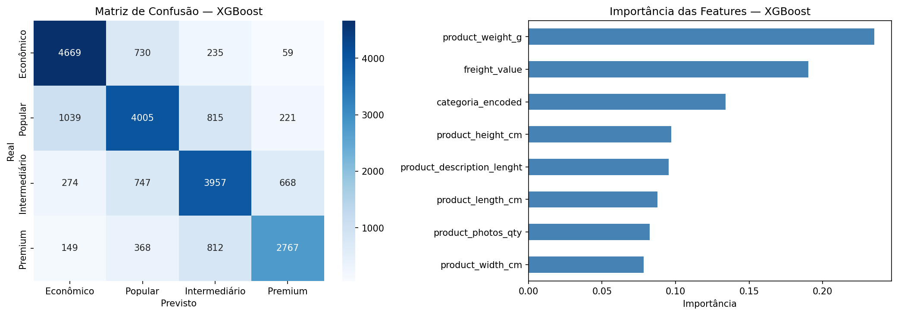
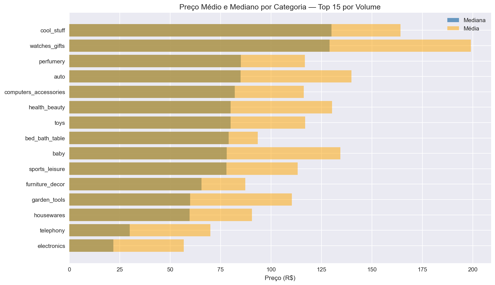
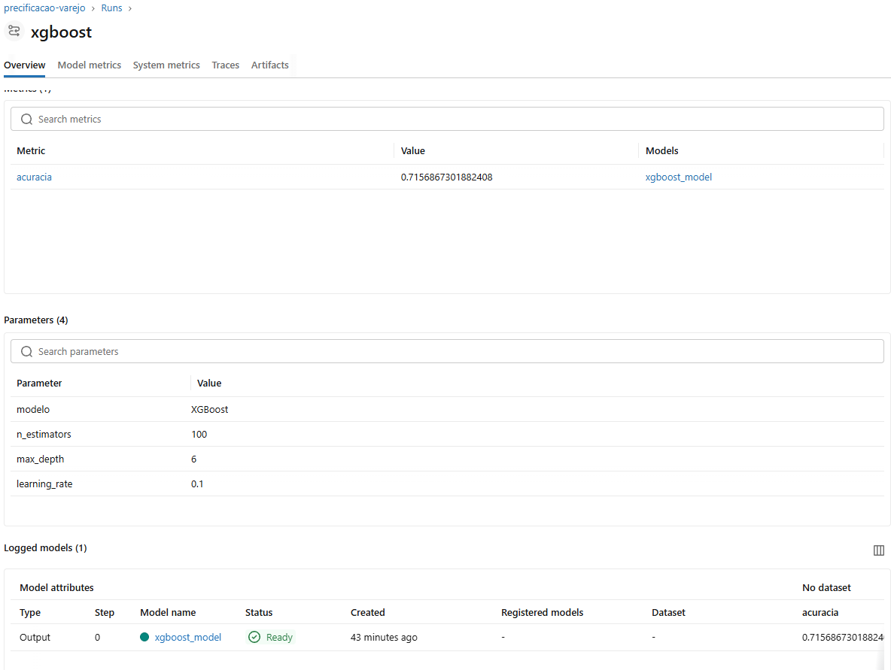

# 🛒 Inteligência de Precificação — E-Commerce Brasileiro

Projeto de Data Science aplicado ao varejo brasileiro, com foco em
precificação inteligente usando dados reais de 100k pedidos do Olist.

## Problema de Negócio

Como prever a faixa de preço de um produto com base em suas
características físicas e categoria? Essa informação orienta decisões
de pricing, mix de produtos e estratégia comercial.

## Resultados

| Modelo | Acurácia |
|---|---|
| Random Forest | 69,5% |
| **XGBoost** | **71,6%** ✅ |

Baseline aleatório seria 25% — modelo entrega **2,8x mais acurácia**.



## Pipeline

Dados Olist (Kaggle)
→ ETL com pandas
→ Feature Engineering
→ Treinamento com scikit-learn + XGBoost
→ Tracking com MLflow
→ Análise de resultados com matplotlib / seaborn

## Principais Insights

- **Peso do produto** é a feature mais preditiva de preço
- **Frete representa 32% do preço médio** — impacto direto na decisão de compra
- **Pico de vendas em novembro/2017** — sazonalidade de Black Friday clara nos dados
- Categorias **watches_gifts** e **cool_stuff** têm maior dispersão de preço



## Stack

- Python (pandas, numpy, scikit-learn, XGBoost)
- MLflow (tracking de experimentos e registro de modelos)



- PySpark (pipeline compatível com Azure Databricks)
- Matplotlib / Seaborn
- Git + GitHub

## Como Reproduzir

```bash
# Clone o repositório
git clone https://github.com/rubenscsilva/inteligencia-precificacao-varejo.git

# Instale as dependências
pip install -r requirements.txt

# Baixe o dataset
# https://www.kaggle.com/datasets/olistbr/brazilian-ecommerce
# Extraia em data/raw/

# Execute os notebooks em ordem
# 01_eda.ipynb → 02_modelo.ipynb
```

## Contexto Acadêmico

Projeto desenvolvido com embasamento em **Análise de Regressão Univariada**
e **Inferência Estatística** (Bacharelado em Estatística — FMU, cursando).

## Autor

**Rubens Cristovão da Silva**
Analista de Dados Sênior | Estatística · Python · dbt · BigQuery
[LinkedIn](https://linkedin.com/in/rubenscsilva) • [GitHub](https://github.com/rubenscsilva)